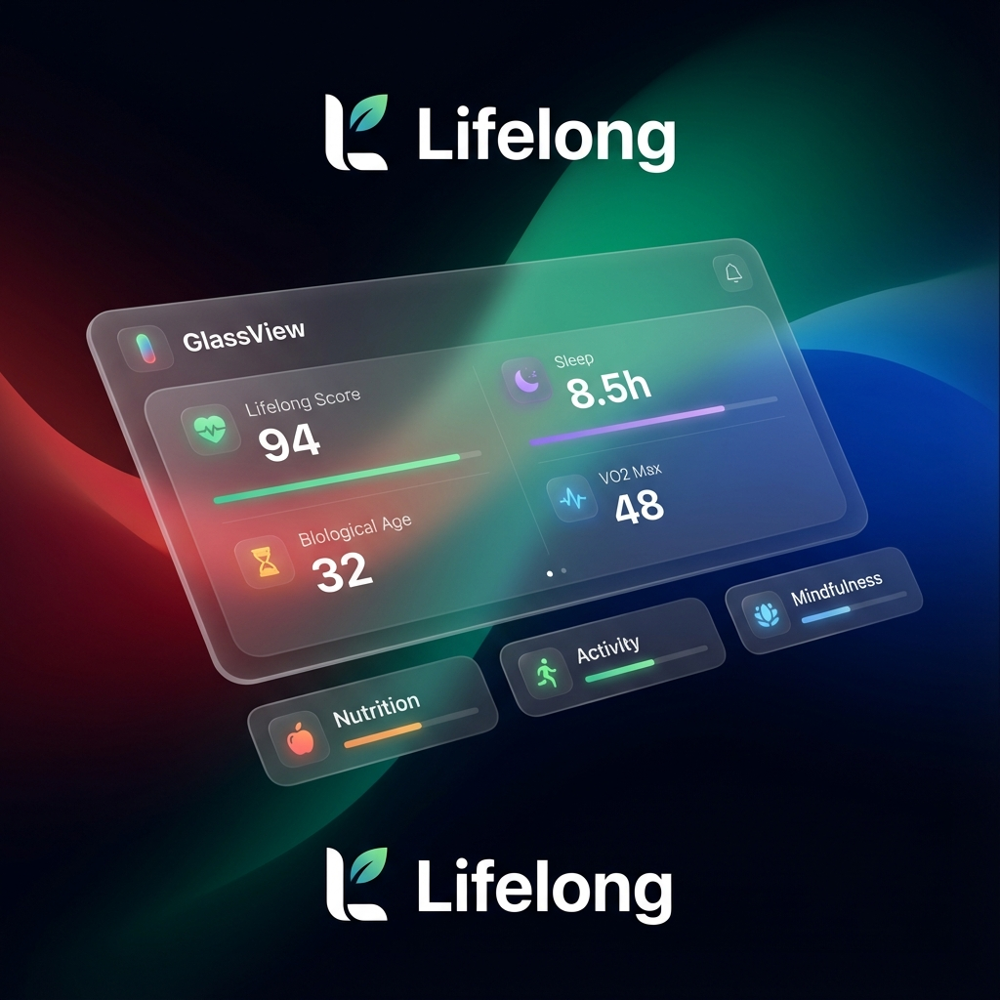
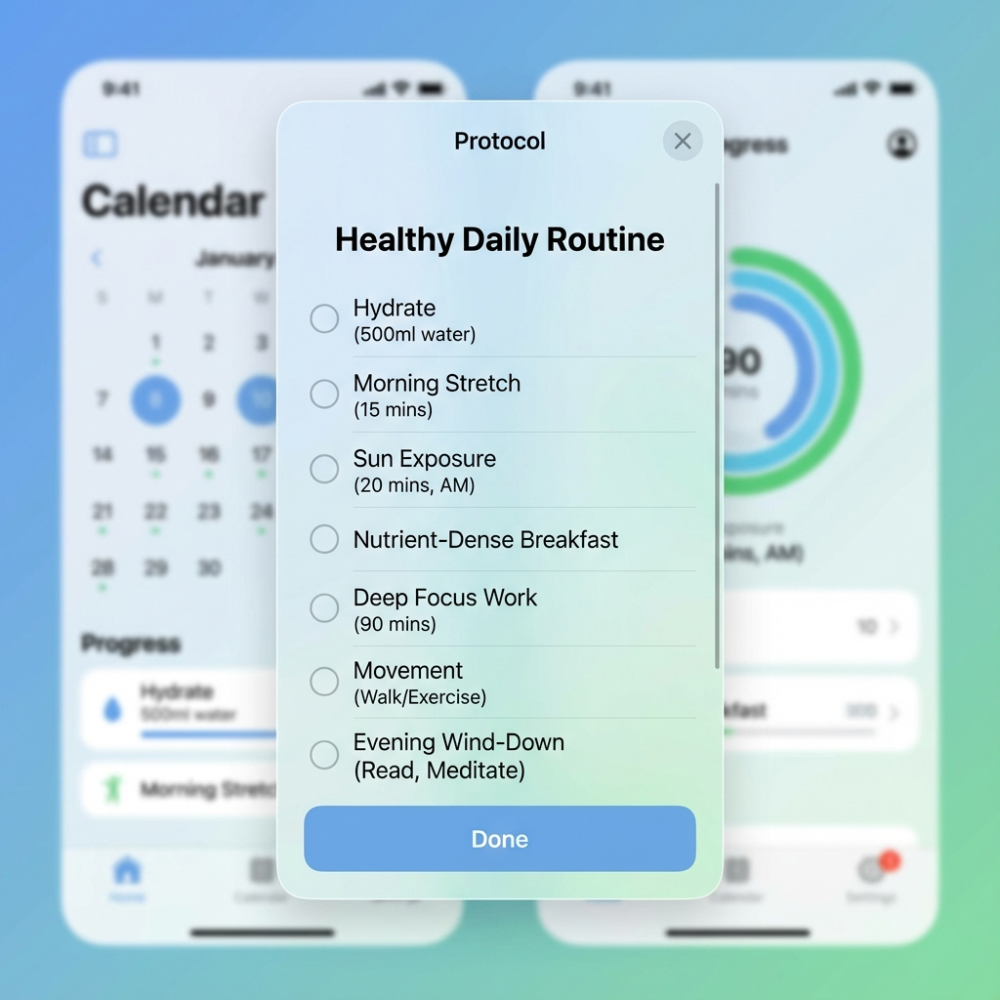

## **Tagline:**

Your Personal Longevity Protocol. Calm, Scientific, Native.

## **X account of the product:**

@raztronaut

## **Description:**

Lifelong is a personal longevity application built for high-fidelity tracking. It combines a native iOS feel with advanced glass-morphism to create a calm, optimistic environment for managing your health protocols. Track your biological age, sleep, family health, and daily routines with a design that feels alive.

## **Launch Tags:**

Health & Fitness

Quantified Self

iOS

Design Tools

## **First Comment:**

**Hey Product Hunt! 🚀 Introducing Lifelong (Liquid Glass).**

We built Lifelong to solve the complexity of longevity tracking. Most health apps are cluttered and stressful. We wanted something that felt calm, optimistic, and beautiful—like a piece of liquid glass in your hand.

**Why Lifelong?**
Managing supplements, protocols, and family health data is overwhelming. Lifelong brings it all together in a unified, high-fidelity interface.

**Key Features:**
- **Glass-morphic UI:** A stunning, translucent interface that feels native and alive.
- **Protocol Tracking:** Manage your daily longevity routines with ease.
- **Family Insights:** Keep track of your family's health metrics in one place.
- **Privacy First:** Your health data stays yours.

We'd love to hear your feedback on the design and features!

*What's the one health metric you check every day?* 🧬

## **Header Image:**

Recommended size: 1200x630 | JPG, PNG, GIF. Max size: 2MB

## **Gallery:**

3 images

1st image is used as preview when sharing link socially

1270x760px or higher recommended

## **Video:**

[Link to video placeholder]

## **Extras:**

Doing a promo or not?
[Link to promo image placeholder]
